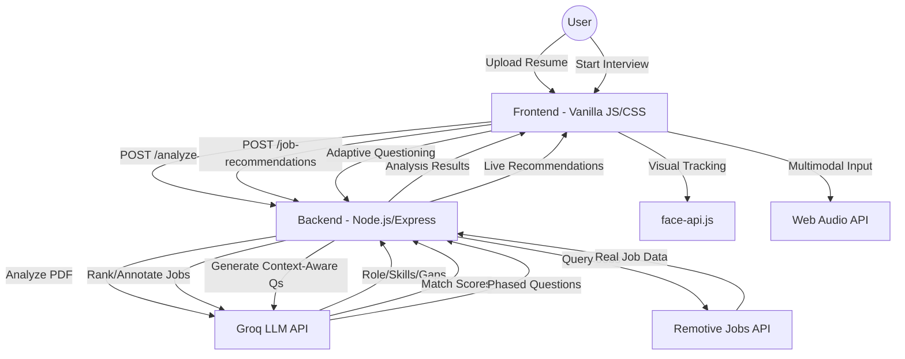

# InterviuX Architecture Document

## Overview
InterviuX is an Agentic AI-powered mock interview platform designed to provide a high-fidelity, multimodal interview experience. It bridges the gap between resume analysis, real-time job matching, and adaptive behavioral/technical evaluation.

## System Architecture

## Key Components

### 1. Agentic Orchestration
The system uses a state-machine based approach to manage interview phases:
- **Warm-up:** Low-to-medium difficulty questions to build confidence.
- **Core:** Standard technical/behavioral questions based on inferred seniority.
- **Deep-dive:** High-difficulty questions (System Design, Architecture) for top performers.
- **Adaptive Pivot:** If a candidate struggles (consecutive low scores), the agent dynamically drops difficulty to foundational levels to rebuild confidence.

### 2. Multimodal Intelligence
- **Visual Intelligence:** Uses `face-api.js` for expression analysis, eye-contact tracking, and a heuristic-based posture detection (detecting slouching or off-center positioning).
- **Audio Intelligence:** Uses the **Web Audio API** for real-time Pitch Variation (expressiveness) and Hesitation Gap detection (>1.2s silence).
- **Linguistic Intelligence:** Uses the **Web Speech API** for transcription and analyzes filler words (um, uh, like), speaking pace (WPM), and technical keyword density.

### 3. Real-time Job Integration
Unlike static mock systems, InterviuX integrates with the **Remotive API** to fetch live job postings. The LLM (Llama-3-70b/8b via Groq) acts as a "Matching Agent," ranking real-world listings against the candidate's specific profile and identifying missing skills for each role.

### 4. Technical Stack
- **Frontend:** HTML5, Vanilla CSS3 (Glassmorphism UI), Vanilla JavaScript.
- **Backend:** Node.js, Express.
- **AI/ML:** Groq Cloud (LLM Orchestration), face-api.js (Client-side CV), Web Speech/Audio APIs.
- **Data:** pdf-parse for resume extraction.

## Evaluation Logic
The `evaluate-answer` chain uses a multi-dimensional rubric with a **Strict Senior Technical Lead** persona:
- **Pre-flight Nonsense Filter:** A deterministic layer (Regex/Phrase-based) that intercepts irrelevant or low-effort answers (e.g., "idk", "abc", "hi") and automatically assigns a 1/10 score before LLM processing.
- **Technical Accuracy:** 1-10 score based on keyword hits and conceptual depth. Aggressively penalizes "keyword dropping" without explanation.
- **Communication Quality:** Confidence score based on pace, filler words, and pitch variation.
- **Visual Engagement:** Scoring based on eye contact and expressions captured during the response.
- **Holistic Calibration:** Scores are capped (e.g., max 5/10) if the answer is unclear or indirect, even if keywords are present.
